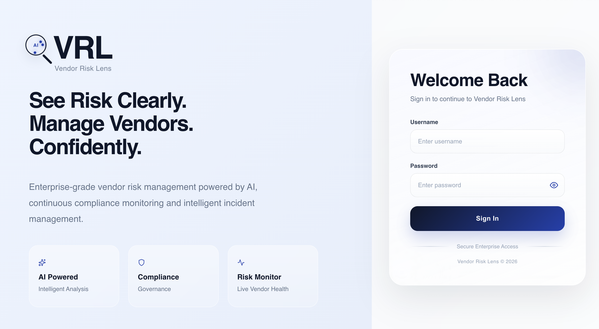
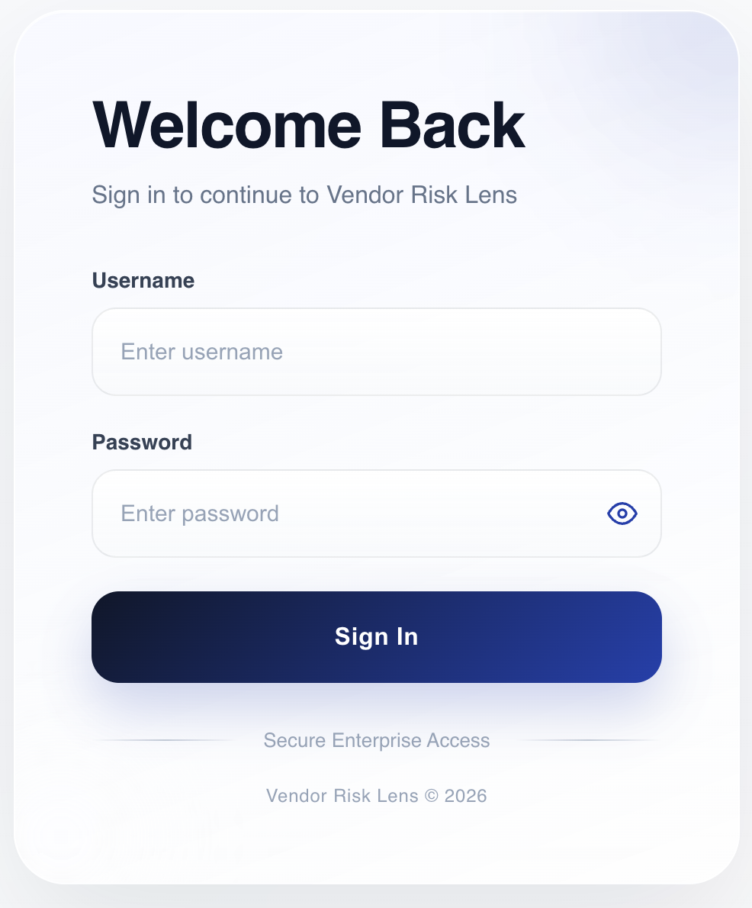
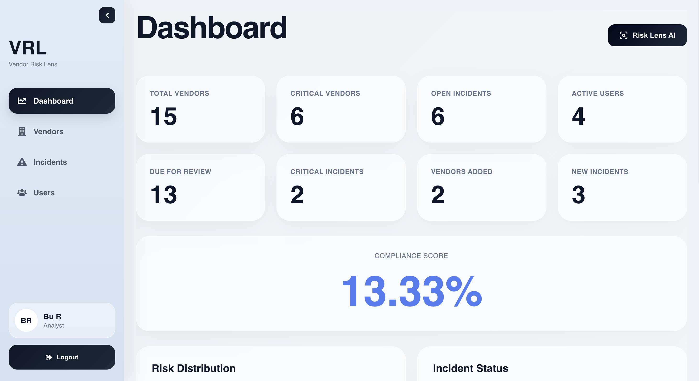
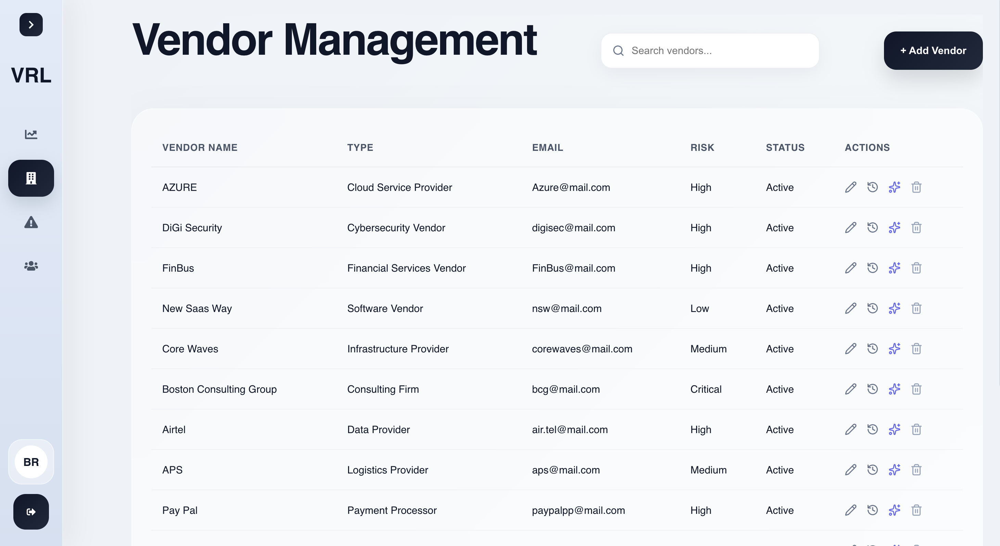
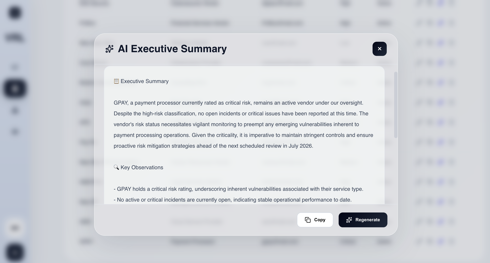
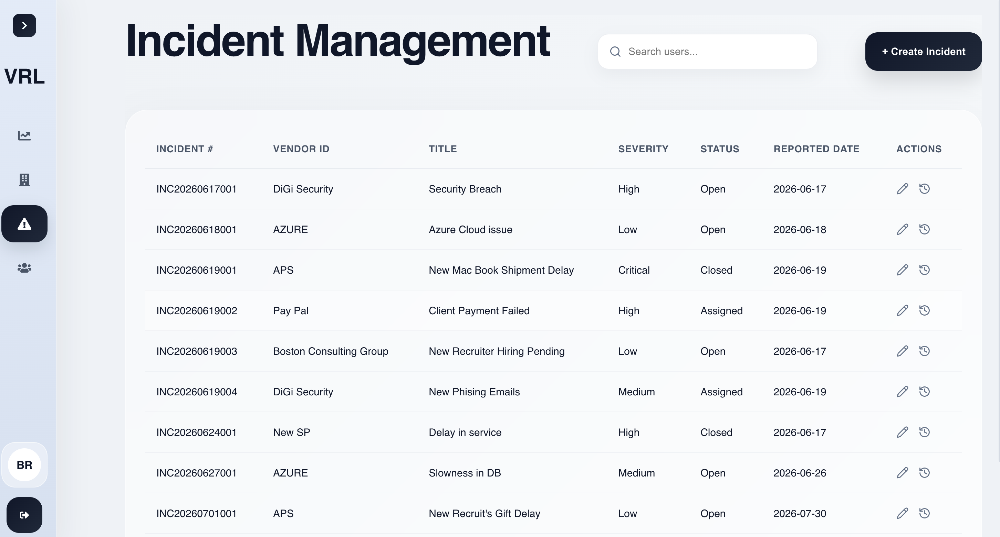
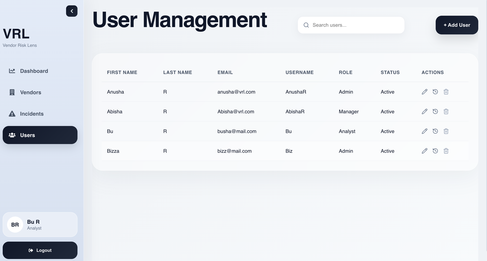
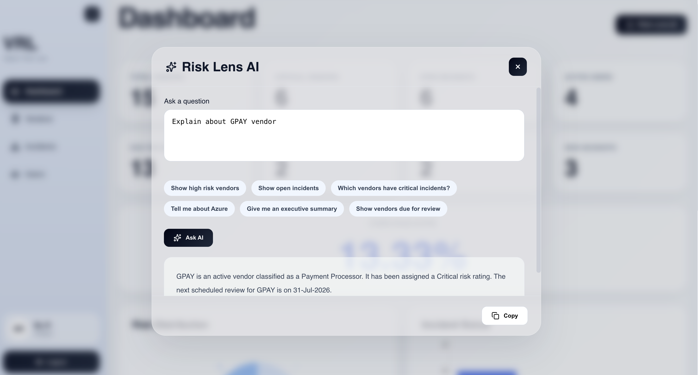

<p align="center">
  
</p>

<h1 align="center">🛡️ Vendor-Risk Lens (VRL)</h1>

<p align="center">
An Enterprise Vendor Risk Management Platform with AI-Powered Business Insights
</p>

<p align="center">

ASP.NET Core • React • SQL Server • OpenAI • JWT Authentication

</p>

---

# 📖 About

Vendor-Risk Lens (VRL) is an enterprise-style Vendor Risk Management platform that helps organizations manage third-party vendors, monitor operational incidents, maintain complete audit visibility, and leverage AI-powered insights for faster business decisions.

The project demonstrates enterprise application architecture using ASP.NET Core, React, Entity Framework Core, SQL Server, JWT Authentication, and OpenAI integration.

---

# 📸 Application Preview

## 🔐 Login



Secure authentication using JWT with BCrypt password hashing.

---

## 📊 Dashboard



Business dashboard displaying:

- KPI Cards
- Compliance Score
- Vendor Risk Metrics
- Incident Statistics
- Recent Vendors
- AI Assistant

---

## 🏢 Vendor Management



Features include:

- Vendor CRUD
- Vendor Search
- AI Executive Summary
- Audit History
- Risk Ratings
- Vendor Types

---

## 🤖 AI Executive Summary



Generate AI-powered executive summaries for vendors including:

- Executive Summary
- Key Business Observations
- Risk Analysis
- Recommendations

---

## 🚨 Incident Management



Enterprise incident tracking featuring:

- Incident CRUD
- Vendor Association
- Severity Management
- Priority Management
- Search
- Audit History

---

## 👥 User Management



Manage users with:

- User CRUD
- Dynamic Roles
- Search
- Active / Inactive Status

---

## 🧠 Risk Lens AI



Natural language business assistant capable of answering questions such as:

- Show high-risk vendors
- List open incidents
- Vendors due for review
- Executive business insights

---

# ✨ Features

## 🔐 Authentication & Security

- JWT Authentication
- Secure Login & Logout
- BCrypt Password Hashing
- Protected API Endpoints
- Protected React Routes
- User Context from JWT

---

## 🏢 Vendor Management

- Vendor CRUD Operations
- Vendor Type Management
- Risk Rating Management
- Vendor Review Tracking
- Active / Inactive Status
- Soft Delete
- Enterprise Search
- AI Executive Summary

---

## 🚨 Incident Management

- Incident CRUD Operations
- Automatic Incident Number Generation
- Vendor Association
- Severity Management
- Priority Management
- Status Tracking
- Resolution Summary
- Enterprise Search

---

## 👥 User Management

- User CRUD Operations
- Dynamic Role Management
- Active / Inactive Users
- Enterprise Search

---

## 📊 Dashboard

- KPI Dashboard
- Compliance Score
- Vendor Risk Distribution
- Open Incident Metrics
- Critical Vendor Metrics
- Recent Vendors
- Monthly Business Statistics

---

## 📝 Audit Logging

Field-level audit tracking including:

- Create History
- Update History
- Delete History
- Previous Values
- New Values
- Username Tracking
- Timestamp History
- Audit History Viewer

---

## 🤖 AI Features

### AI Executive Summary

Generate business-ready executive summaries using OpenAI.

Includes:

- Executive Summary
- Business Observations
- Potential Risks
- Recommendations

---

### Risk Lens AI

Enterprise AI assistant capable of answering natural language business questions.

Workflow:

1. Detect user intent
2. Retrieve only required business data
3. Build optimized business context
4. Send context to OpenAI
5. Generate enterprise-ready response

Benefits:

- Reduced token usage
- Improved response quality
- Minimal business data exposure

---

# 🔍 Enterprise Search

Enterprise search is available across:

- Vendors
- Incidents
- Users

Implemented using:

- Entity Framework Core
- LINQ
- DTO Projection
- SQL Query Translation

---

# 🛠️ Tech Stack

## Backend

- ASP.NET Core 10 Web API
- Entity Framework Core
- SQL Server
- OpenAI API
- Swagger
- Dependency Injection

---

## Frontend

- React
- Vite
- Lucide React
- Recharts
- CSS3
- Responsive Glassmorphism UI

---

## Security

- JWT Authentication
- BCrypt Password Hashing
- Protected APIs
- Protected Routes

---

## Development Tools

- Git
- GitHub
- Docker
- SQL Server
- DBeaver
- Postman
- Visual Studio Code

---

# 🏗️ Architecture

```text
                 React + Vite
                      │
                      ▼
          ASP.NET Core Web API
                      │
                      ▼
              Business Services
                      │
        ┌─────────────┼──────────────┐
        │             │              │
        ▼             ▼              ▼
 Vendor Service  Incident Service  User Service
        │             │              │
        └─────────────┼──────────────┘
                      ▼
             Dashboard Service
                      │
                      ▼
              Audit Log Service
                      │
                      ▼
                  AI Service
                      │
                      ▼
                 OpenAI API
                      │
                      ▼
                 SQL Server
```

---

# 💼 Enterprise Concepts Demonstrated

- Layered Architecture
- Service Pattern
- Repository-style Service Layer
- DTO Pattern
- REST API Design
- Dependency Injection
- Entity Framework Core
- LINQ Queries
- LINQ Joins
- JWT Authentication
- BCrypt Password Hashing
- Enterprise Search
- Audit Logging
- OpenAI Integration
- Responsive UI

---

# 🖥️ Application Modules

- 🔐 Login
- 📊 Dashboard
- 🏢 Vendors
- 🚨 Incidents
- 👥 Users
- 📝 Audit History
- 🤖 AI Executive Summary
- 🧠 Risk Lens AI

---

# 📌 Current Status

## ✅ Completed

- JWT Authentication
- BCrypt Password Hashing
- Vendor Management
- Incident Management
- User Management
- Dashboard
- Enterprise Search
- DTO Architecture
- LINQ Joins
- Audit Logging
- AI Executive Summary
- Risk Lens AI
- Responsive UI
- Glassmorphism UI

---

## 🚀 Future Enhancements

- Pagination
- Column Sorting
- PostgreSQL Support
- Cloud Deployment

---

# 📂 Project Structure

```text
Backend/
│
├── Controllers
├── DTOs
├── Models
├── Services
├── Data
└── Program.cs

Frontend/
│
├── Components
├── Pages
├── Services
├── Layouts
└── Assets
```

---

# 👨‍💻 Repository Purpose

Vendor-Risk Lens demonstrates enterprise full-stack software development using modern Microsoft technologies together with AI integration.

Key technologies showcased include:

- ASP.NET Core Web API
- React + Vite
- Entity Framework Core
- SQL Server
- JWT Authentication
- BCrypt Password Hashing
- OpenAI API
- Enterprise Dashboard
- Audit Logging
- Responsive UI
- AI-Powered Business Insights

---

<p align="center">
⭐ If you found this project interesting, consider giving it a star!
</p>